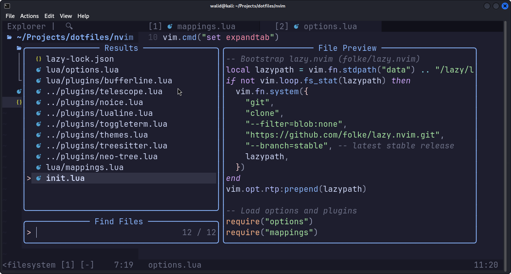
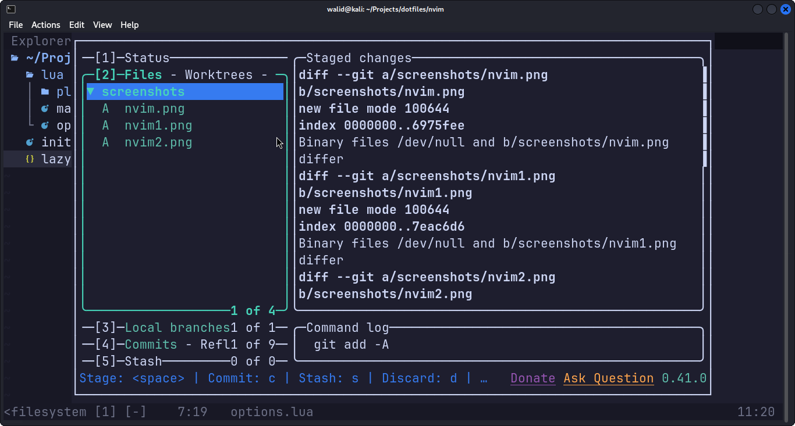
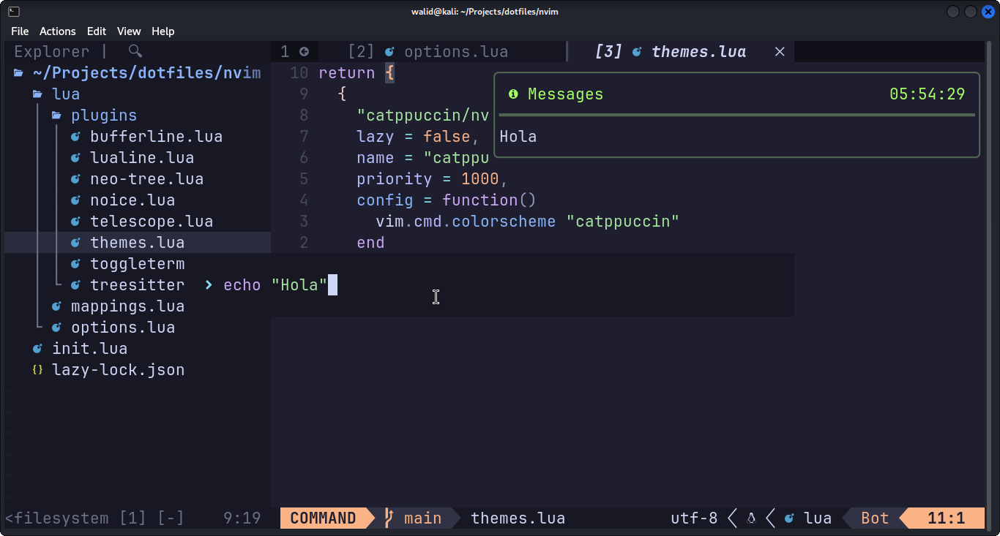
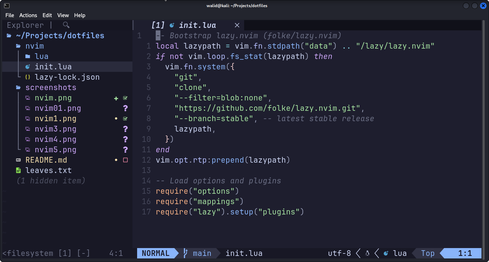
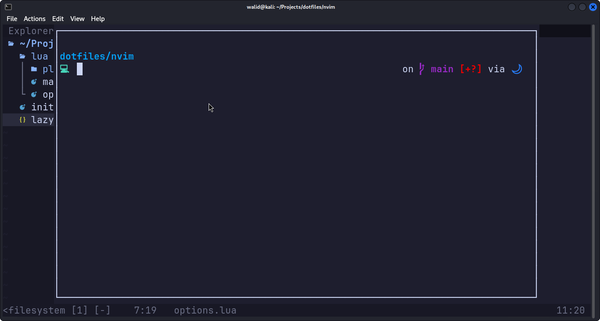
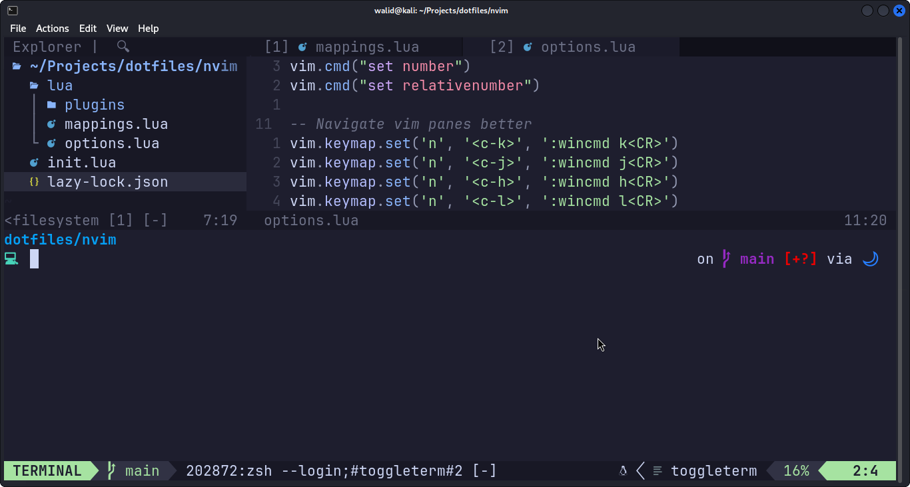
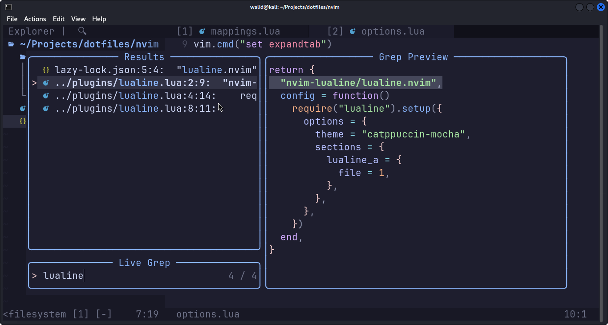

## My Collection of Dotfiles symlinked.

### Installation

#### 1. Setup the symlinks :

First clone this repos and make sure `stow` is present on your system in order to using to create the symlinks

###### Install `stow` (Debian)

```bash
sudo apt install stow
```

Then run :

```bash
stow --target ~/.config .
```

#### 2. Install the needed packages

Including `neovim`, `starship`, `lazygit` ..etc

main list of packages:

- neovim
- starship
- ripgrep
- lazygit
- ...

You can find the full list in `leaves.txt`

##### Install using brew :

```bash
xargs brew install < leaves.txt
```

### Screenshots

#### 1. Neovim setup








